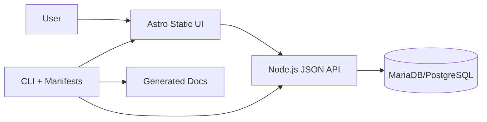
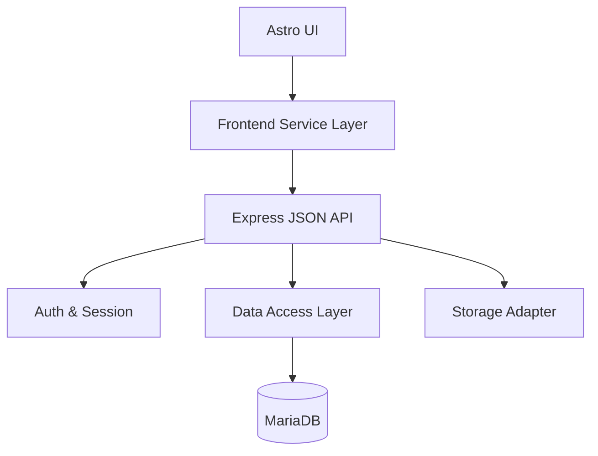
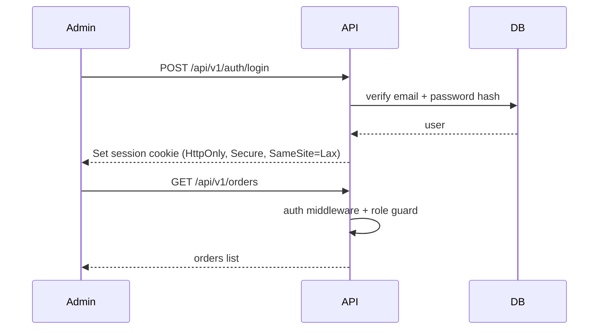
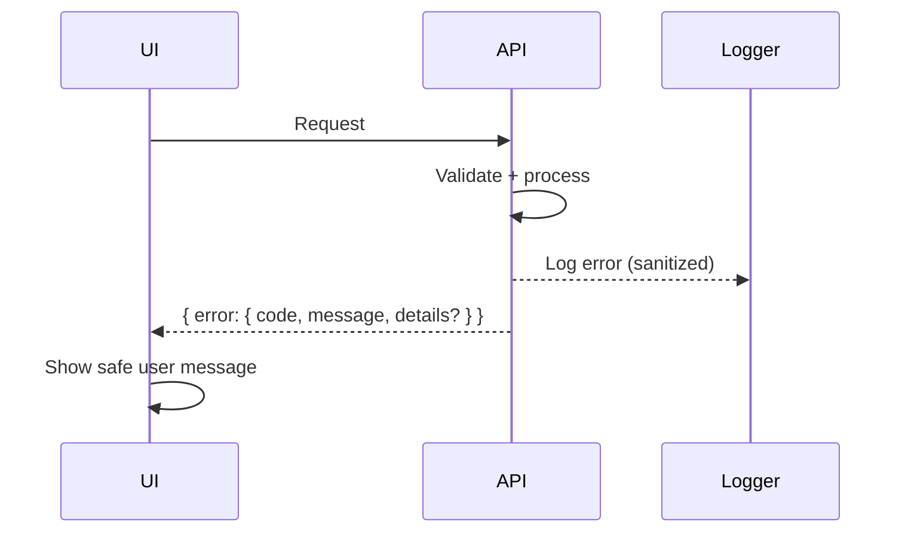

# Astro Modular Template (Internal) Fullstack Architecture Document

## Introduction
This document outlines the complete fullstack architecture for Astro Modular Template (Internal), including backend systems, frontend implementation, and their integration. It serves as the single source of truth for AI-driven development, ensuring consistency across the entire technology stack.

This unified approach combines what would traditionally be separate backend and frontend architecture documents, streamlining the development process for modern fullstack applications where these concerns are increasingly intertwined.

### Starter Template or Existing Project
N/A - Greenfield project.

### Change Log
| Date | Version | Description | Author |
| --- | --- | --- | --- |
| 2026-01-16 | v0.1 | Initial architecture draft | Winston (Architect) |

## High Level Architecture

### Technical Summary
The system is a monorepo that contains the CLI, module manifests/templates, a static Astro UI, and an optional self-hosted Node.js JSON API for backend-enabled presets. Frontend defaults to static output with minimal, accessible UI and no default branding, while backend modules run as a separate API service (no Astro SSR by default). The CLI composes projects using manifests and patch points, ensuring module isolation and clean outputs. Deployment targets are static hosting for UI and o2switch for the JSON API, aligned with the self-hosted constraints. This architecture meets the goals of fast reuse, strict module boundaries, and a complete internal baseline for commerce workflows.

### Platform and Infrastructure Choice
**Option A: o2switch (Static UI + Node.js JSON API)**
- Pros: Matches self-hosted constraint; avoids SaaS; supports MariaDB/PostgreSQL; aligns with deployment defaults.
- Cons: Requires manual ops discipline (backups, logs, monitoring).

**Option B: Self-hosted VPS (same architecture, non-o2switch)**
- Pros: Maximum control; portable architecture.
- Cons: Higher ops burden and less aligned to primary hosting.

**Option C: Local-first + manual deploy scripts**
- Pros: Simplest path; minimal tooling.
- Cons: Less repeatable and more error-prone at scale.

**Recommendation:** Option A (o2switch static UI + Node.js JSON API), with Option B as fallback for portability.

### Repository Structure
**Structure:** Monorepo (generator/tooling repo only)
**Monorepo Tool:** npm/pnpm workspaces
**Package Organization:**
- `packages/cli` (create/add/remove, manifest processing)
- `packages/modules` (module manifests + module file templates/snippets)
- `packages/shared` (types, config schema, utilities)
- `templates/base` (Astro base template source)
- `templates/presets/*` (vitrine/blog/commerce composition metadata or preset manifests)
- `docs/` (PRD, architecture, generated docs)
- `examples/` or `sandbox/` (optional smoke tests, not for generated apps)

### High Level Architecture Diagram


### Architectural Patterns
- **Static-First UI + Separate API:** Static frontend with a dedicated JSON API service - _Rationale:_ Clear UI/API boundary and avoids SSR by default.
- **Monorepo Workspace:** Single repo with workspaces - _Rationale:_ Shared types, simpler internal tooling.
- **Manifest-Driven Composition:** Modules defined by manifests and patch points - _Rationale:_ Predictable add/remove and clean outputs.
- **Service Layer on Frontend:** API access encapsulated in services - _Rationale:_ Consistent data access and testability.
- **Repository/Data Access Layer:** Abstract DB operations - _Rationale:_ Supports MariaDB default with PostgreSQL portability.

## Tech Stack

### Technology Stack Table
| Category | Technology | Version | Purpose | Rationale |
| --- | --- | --- | --- | --- |
| Frontend Language | TypeScript | 5.6.0 | Type-safe UI and tooling | Matches Astro + strong typing preference |
| Frontend Framework | Astro | 5.0.0 | Static-first UI generation | Static by default, framework-agnostic |
| UI Component Library | None (custom minimal) | N/A | Neutral, minimal UI | Avoids default branding |
| State Management | Minimal (local state + URL) | N/A | Simple UI flows | Avoids unnecessary complexity |
| Backend Language | TypeScript | 5.6.0 | API service | Consistency across stack |
| Runtime (Node.js) | Node.js | 22.19.0 | CLI/API runtime | Pinned LTS |
| Backend Framework | Express | Latest stable | JSON API service | Simple, self-hosted, widely supported |
| API Style | REST | N/A | JSON API endpoints | Matches PRD API contract |
| Database | MariaDB (default), PostgreSQL supported | Latest stable | Orders + users | Self-hosted constraint |
| Cache | In-memory (server session) | N/A | Cart storage | Session-based cart in v1 |
| File Storage | Local filesystem (with abstraction) | N/A | Product images | Self-hosted v1; extensible to S3 later |
| Authentication | Custom email/password + sessions/JWT | N/A | Self-hosted auth | No SaaS, extensible later |
| Frontend Testing | Vitest | 2.0.0 | Unit tests | Fast TS testing |
| Backend Testing | Vitest | 2.0.0 | API/service tests | Shared tooling |
| E2E Testing | Optional (Playwright) | Latest stable | Critical flow smoke tests | Optional in v1 |
| Build Tool | Vite (via Astro) | Bundled | Frontend build | Astro default |
| Bundler | Vite | Bundled | Frontend bundling | Astro default |
| IaC Tool | None (v1) | N/A | Infra management | Keep ops minimal |
| Package Manager | pnpm | 10.0.0 | Monorepo tooling | Deterministic workspace installs |
| Linting | ESLint | 9.0.0 | Code linting | Pinned for consistency |
| Formatting | Prettier | 3.3.0 | Code formatting | Pinned for consistency |
| CI/CD | GitHub Actions | Latest | Lint/typecheck/build | Matches PRD |
| Monitoring | Minimal (logs + health checks) | N/A | Self-hosted ops | Aligns with ops constraints |
| Logging | Pino | Latest stable | API logging | Structured JSON logs, low overhead |
| CSS Framework | None by default (TailwindCSS optional) | 4.0.0 (if enabled) | Neutral UI | Avoid default theme |

## Data Models

### User
**Purpose:** Represents authenticated users (admin or customer) for self-hosted auth and order ownership.

**Key Attributes:**
- id: string (uuid)
- email: string
- passwordHash: string
- role: "admin" | "customer"
- createdAt: string (ISO)

```typescript
export interface User {
  id: string;
  email: string;
  passwordHash: string;
  role: "admin" | "customer";
  createdAt: string;
}
```

**Relationships:**
- User may have many Orders (optional for guest checkout)

### Session
**Purpose:** Stores server-side session data (including cart state).

**Key Attributes:**
- id: string
- userId: string | null
- expiresAt: string (ISO)
- cart: Cart

```typescript
export interface CartItem {
  productId: string;
  quantity: number;
  unitPriceCents: number;
}

export interface Cart {
  items: CartItem[];
  currency: "EUR";
  updatedAt: string;
}

export interface Session {
  id: string;
  userId: string | null;
  expiresAt: string;
  cart: Cart;
}
```

**Relationships:**
- Session optionally links to User
- Session contains Cart data (no separate cart table in v1)

### Product
**Purpose:** Catalog item for restaurant/commerce.

**Key Attributes:**
- id: string (uuid)
- name: string
- description: string
- priceCents: number
- imageUrl: string | null
- isActive: boolean

```typescript
export interface Product {
  id: string;
  name: string;
  description: string;
  priceCents: number;
  imageUrl?: string | null;
  isActive: boolean;
}
```

**Relationships:**
- Product referenced by OrderItem

### Order
**Purpose:** Represents a submitted order (guest checkout supported).

**Key Attributes:**
- id: string (uuid)
- userId: string | null
- customerName: string
- customerEmail: string
- customerPhone: string
- fulfillmentType?: "pickup" | "delivery"
- notes?: string
- totalCents: number
- status: "pending" | "confirmed" | "cancelled"
- createdAt: string (ISO)

```typescript
export interface Order {
  id: string;
  userId?: string | null;
  customerName: string;
  customerEmail: string;
  customerPhone: string;
  fulfillmentType?: "pickup" | "delivery";
  notes?: string;
  totalCents: number;
  status: "pending" | "confirmed" | "cancelled";
  createdAt: string;
}
```

**Relationships:**
- Order has many OrderItems
- Order optionally links to User

### OrderItem
**Purpose:** Line items within an order.

**Key Attributes:**
- id: string (uuid)
- orderId: string
- productId: string
- quantity: number
- unitPriceCents: number

```typescript
export interface OrderItem {
  id: string;
  orderId: string;
  productId: string;
  quantity: number;
  unitPriceCents: number;
}
```

**Relationships:**
- OrderItem belongs to Order
- OrderItem references Product

### Notes
- Prices stored as integer minor units (cents).
- Order status values remain pending/confirmed/cancelled in v1.

## API Specification (REST)

```yaml
openapi: 3.0.0
info:
  title: Astro Commerce API
  version: v1
  description: Self-hosted JSON API for restaurant commerce preset.
servers:
  - url: https://api.example.com
    description: Production API
paths:
  /api/v1/auth/register:
    post:
      summary: Register a new user (disabled by default in v1)
  /api/v1/auth/login:
    post:
      summary: Login with email/password
  /api/v1/auth/logout:
    post:
      summary: Logout current session
  /api/v1/auth/me:
    get:
      summary: Get current user session
  /api/v1/products:
    get:
      summary: List products
    post:
      summary: Create product (admin only)
  /api/v1/products/{id}:
    get:
      summary: Get product by id
    patch:
      summary: Update product (admin only)
    delete:
      summary: Delete product (admin only)
  /api/v1/cart:
    get:
      summary: Get current cart (session-based)
  /api/v1/cart/items:
    post:
      summary: Add item to cart
  /api/v1/cart/items/{productId}:
    patch:
      summary: Update cart item quantity
    delete:
      summary: Remove cart item
  /api/v1/orders:
    post:
      summary: Create order from cart (public, guest allowed)
    get:
      summary: List orders (admin only)
  /api/v1/orders/{id}:
    get:
      summary: Get order details (admin only)
```

Notes:
- Register is disabled by default in v1; admin user created via seed/CLI.
- Guest checkout allowed for POST /api/v1/orders with strict validation + rate limiting.
- Cart item identifiers use productId in the path (session-based).
- Admin product CRUD included even without a full admin UI.

## Components

### Astro UI (Static)
**Responsibility:** Render vitrine/blog/commerce pages with minimal neutral UI and accessible structure.

**Key Interfaces:**
- `GET /api/v1/products`
- `POST /api/v1/cart/items`, `PATCH /api/v1/cart/items/{productId}`, `DELETE /api/v1/cart/items/{productId}`
- `POST /api/v1/orders`

**Dependencies:** Frontend Service Layer, API Client, Shared Types

**Technology Stack:** Astro + TypeScript

### API Client (Fetch Wrapper)
**Responsibility:** Base URL handling, credentials/cookies, error normalization, typed responses.

**Key Interfaces:**
- `request<T>(path, options)`

**Dependencies:** Shared Types

**Technology Stack:** TypeScript

### Frontend Service Layer
**Responsibility:** Encapsulate API calls and map JSON to typed models.

**Key Interfaces:**
- ProductService (list/get)
- CartService (get/add/update/remove)
- OrderService (create)

**Dependencies:** API Client, Shared Types

**Technology Stack:** TypeScript

### JSON API Service (Express)
**Responsibility:** Expose REST endpoints, handle auth/session, cart, orders, and admin product CRUD.

**Key Interfaces:**
- `/api/v1/auth/*`
- `/api/v1/products/*`
- `/api/v1/cart/*`
- `/api/v1/orders/*`

**Dependencies:** Data Access Layer, Auth/Session Middleware, Logger

**Technology Stack:** Node.js + Express + TypeScript

### Auth & Session Module
**Responsibility:** Login/logout, session management, role checks, rate limiting.

**Key Interfaces:**
- Session middleware
- Role guard

**Dependencies:** User repository, Session store

**Technology Stack:** Express middleware + session store

**Session Store:** DB-backed (MariaDB) in production; in-memory allowed for local dev.

### Data Access Layer (Repository)
**Responsibility:** CRUD for Users, Products, Orders, OrderItems.

**Key Interfaces:**
- UserRepo, ProductRepo, OrderRepo

**Dependencies:** MariaDB driver (PostgreSQL optional)

**Technology Stack:** Knex.js (migrations) + repository layer

### Storage Adapter
**Responsibility:** Read/write product images on local filesystem; optional S3 adapter later.

**Key Interfaces:**
- saveFile, getFilePath

**Dependencies:** FS

**Technology Stack:** Node.js fs

### Component Diagram


## External APIs
None for v1.

## Core Workflows

```mermaid
sequenceDiagram
  autonumber
  %% Workflow A: CLI create -> add -> remove
  rect rgba(200,200,200,0.15)
    participant User
    participant CLI
    participant Manifests
    participant Templates
    participant FS as FileSystem
    User->>CLI: create --preset vitrine
    CLI->>Manifests: load preset + module manifests
    CLI->>Templates: apply base + preset templates
    CLI->>FS: write generated project files
    User->>CLI: add module (e.g., blog)
    CLI->>Manifests: load module manifest
    CLI->>Templates: apply patch points + files
    CLI->>FS: update project files
    User->>CLI: remove module (limited)
    CLI->>Manifests: read ownership list
    CLI->>FS: delete owned files + remove patch insertions
  end

  %% Workflow B: Catalog -> Cart -> Checkout
  rect rgba(200,200,200,0.15)
    participant Customer
    participant UI as Astro UI
    participant API as JSON API
    participant Sess as Session Store (DB)
    participant DB
    Customer->>UI: Browse catalog
    UI->>API: GET /api/v1/products
    API->>DB: query products
    DB-->>API: products
    API-->>UI: products
    Customer->>UI: Add item to cart
    UI->>API: POST /api/v1/cart/items
    API->>Sess: persist cart (session)
    API-->>UI: cart summary
    Customer->>UI: Checkout
    UI->>API: POST /api/v1/orders
    API->>DB: create order + items
    DB-->>API: order id
    API-->>UI: order confirmation
  end

  %% Workflow C: Admin Auth + Management
  rect rgba(200,200,200,0.15)
    participant Admin
    Admin->>API: POST /api/v1/auth/login
    API-->>Admin: Session cookie set
    Admin->>API: POST /api/v1/products (admin)
    API-->>Admin: product created
    Admin->>API: PATCH /api/v1/products/{id} (admin)
    API-->>Admin: product updated
    Admin->>API: GET /api/v1/orders (admin)
    API-->>Admin: order list
    Admin->>API: GET /api/v1/orders/{id} (admin)
    API-->>Admin: order detail
  end

  %% Workflow D: Session + Security Lifecycle
  rect rgba(200,200,200,0.15)
    participant Guest
    Guest->>API: POST /api/v1/cart/items
    API-->>Guest: Session cookie (HttpOnly, Secure, SameSite)
    Guest->>API: POST /api/v1/orders
    API-->>Guest: Rate limited (if exceeded)
    Note over API: Session rotates on login; expires per config; cart persists in session
  end
```

## Database Schema

```sql
-- MariaDB v1 schema (hardened)

CREATE TABLE users (
  id VARCHAR(36) PRIMARY KEY,
  email VARCHAR(255) NOT NULL UNIQUE,
  password_hash VARCHAR(255) NOT NULL,
  role ENUM('admin','customer') NOT NULL,
  created_at DATETIME NOT NULL
) ENGINE=InnoDB DEFAULT CHARSET=utf8mb4 COLLATE=utf8mb4_unicode_ci;

CREATE TABLE products (
  id VARCHAR(36) PRIMARY KEY,
  name VARCHAR(255) NOT NULL,
  description TEXT NOT NULL,
  price_cents INT NOT NULL,
  image_url VARCHAR(512) NULL,
  is_active TINYINT(1) NOT NULL DEFAULT 1,
  created_at DATETIME NOT NULL,
  updated_at DATETIME NOT NULL
) ENGINE=InnoDB DEFAULT CHARSET=utf8mb4 COLLATE=utf8mb4_unicode_ci;

CREATE TABLE orders (
  id VARCHAR(36) PRIMARY KEY,
  user_id VARCHAR(36) NULL,
  customer_name VARCHAR(255) NOT NULL,
  customer_email VARCHAR(255) NOT NULL,
  customer_phone VARCHAR(64) NOT NULL,
  fulfillment_type ENUM('pickup','delivery') NULL,
  notes TEXT NULL,
  total_cents INT NOT NULL,
  status ENUM('pending','confirmed','cancelled') NOT NULL,
  created_at DATETIME NOT NULL,
  updated_at DATETIME NOT NULL,
  FOREIGN KEY (user_id) REFERENCES users(id) ON DELETE SET NULL
) ENGINE=InnoDB DEFAULT CHARSET=utf8mb4 COLLATE=utf8mb4_unicode_ci;

CREATE TABLE order_items (
  id VARCHAR(36) PRIMARY KEY,
  order_id VARCHAR(36) NOT NULL,
  product_id VARCHAR(36) NOT NULL,
  quantity INT NOT NULL,
  unit_price_cents INT NOT NULL,
  FOREIGN KEY (order_id) REFERENCES orders(id) ON DELETE CASCADE,
  FOREIGN KEY (product_id) REFERENCES products(id)
) ENGINE=InnoDB DEFAULT CHARSET=utf8mb4 COLLATE=utf8mb4_unicode_ci;

CREATE TABLE sessions (
  id VARCHAR(255) PRIMARY KEY,
  user_id VARCHAR(36) NULL,
  created_at DATETIME NOT NULL,
  expires_at DATETIME NOT NULL,
  cart_json JSON NOT NULL DEFAULT (JSON_OBJECT()),
  FOREIGN KEY (user_id) REFERENCES users(id)
) ENGINE=InnoDB DEFAULT CHARSET=utf8mb4 COLLATE=utf8mb4_unicode_ci;

CREATE INDEX idx_products_active ON products(is_active);
CREATE INDEX idx_orders_created_at ON orders(created_at);
CREATE INDEX idx_orders_status_created_at ON orders(status, created_at);
CREATE INDEX idx_orders_user_id ON orders(user_id);
CREATE INDEX idx_order_items_order_id ON order_items(order_id);
CREATE INDEX idx_sessions_user_id ON sessions(user_id);
CREATE INDEX idx_sessions_expires_at ON sessions(expires_at);
```

Notes:
- `cart_json` default uses `JSON_OBJECT()` where supported; otherwise set in application code.
- Products use soft delete via `is_active`; product FK remains intact for order history.

## Frontend Architecture

### Component Architecture

Component Organization
```text
src/
  components/
    layout/
      BaseLayout.astro
      Header.astro
      Footer.astro
    ui/
      Button.astro
      Input.astro
      Card.astro
    commerce/
      ProductCard.astro
      CartSummary.astro
      CheckoutForm.astro
  pages/
    index.astro
    products/index.astro
    products/[id].astro
    cart.astro
    checkout.astro
    admin/orders.astro
  services/
    apiClient.ts
    productService.ts
    cartService.ts
    orderService.ts
  scripts/
    cart.ts
  config/
    app.config.ts
    env.ts
```

Component Template (Astro)
```typescript
---
// ProductCard.astro
const { product } = Astro.props;
---
<article class="product-card">
  <h2>{product.name}</h2>
  <p>{product.description}</p>
  <p>{(product.priceCents / 100).toFixed(2)} EUR</p>
  <button data-product-id={product.id} class="add-to-cart">
    Add to cart
  </button>
</article>
```

### State Management Architecture

State Structure
```typescript
export interface CartState {
  items: Array<{ productId: string; quantity: number; unitPriceCents: number }>;
  currency: "EUR";
  updatedAt: string;
}
```

State Management Patterns
- Server-source-of-truth: cart is stored in session; UI fetches after mutations.
- Minimal client cache: store cart state in memory for current page render only.

### Routing Architecture

Route Organization
```text
/                -> Home
/products        -> Product list
/products/[id]   -> Product detail
/cart            -> Cart
/checkout        -> Checkout
/admin/orders    -> Optional minimal admin order list
```

Protected Route Pattern (Admin)
```typescript
// admin/orders.astro (pseudo)
import { apiGet } from "../services/apiClient";
const user = await apiGet("/api/v1/auth/me");
if (!user || user.role !== "admin") {
  // render login link or minimal auth notice
}
```

Admin Orders Page (static UI)
- Static shell page with client-side script:
  - Calls `/api/v1/auth/me`
  - If admin, fetches `/api/v1/orders`
  - If not admin, shows minimal login link or access notice

### Frontend Services Layer

API Client Setup
```typescript
const API_BASE = import.meta.env.PUBLIC_API_BASE_URL;

export async function apiRequest<T>(path: string, options: RequestInit = {}): Promise<T> {
  const res = await fetch(`${API_BASE}${path}`, {
    credentials: "include",
    headers: { "Content-Type": "application/json", ...(options.headers || {}) },
    ...options,
  });
  if (!res.ok) {
    const error = await res.json().catch(() => ({ error: { message: "Unknown error" } }));
    throw new Error(error?.error?.message || "Request failed");
  }
  return res.json() as Promise<T>;
}
```

Service Example
```typescript
export function listProducts() {
  return apiRequest<Product[]>("/api/v1/products");
}
```

CORS + Session Cookies (o2switch)
- API CORS allowlist (no `*`) with credentials enabled.
- Session cookie settings:
  - `HttpOnly` and `Secure`
  - `SameSite=Lax` when UI and API share the same registrable domain
  - Use `SameSite=None` only if cross-site is required later
- Required env vars:
  - `PUBLIC_API_BASE_URL` (frontend)
  - `API_ALLOWED_ORIGIN` (backend)

## Backend Architecture

### Service Architecture (Traditional Server)

Controller/Route Organization
```text
src/
  app.ts
  server.ts
  routes/
    auth.routes.ts
    products.routes.ts
    cart.routes.ts
    orders.routes.ts
  controllers/
    auth.controller.ts
    products.controller.ts
    cart.controller.ts
    orders.controller.ts
  middleware/
    auth.middleware.ts
    role.middleware.ts
    rateLimit.middleware.ts
    session.middleware.ts
    error.middleware.ts
  services/
    auth.service.ts
    products.service.ts
    cart.service.ts
    orders.service.ts
  repositories/
    user.repo.ts
    product.repo.ts
    order.repo.ts
  db/
    index.ts
    migrations/
  storage/
    localStorage.ts
  utils/
    logger.ts
    validate.ts
```

Controller Template
```typescript
// products.controller.ts
import { listProducts } from "../services/products.service";

export async function getProducts(req, res, next) {
  try {
    const products = await listProducts();
    res.json(products);
  } catch (err) {
    next(err);
  }
}
```

### Database Architecture
- Knex.js (MariaDB) with built-in migrations.
- Thin repository layer on top of Knex.

### Authentication and Authorization
- `express-session` + `express-mysql-session` for production session store.
- In-memory session store for local dev only.
- Zod validation on all request bodies.
- Error shape: `{ error: { code, message, details? } }` from a single error middleware.

Auth Flow


Middleware/Guards (example)
```typescript
export function requireAuth(req, res, next) {
  if (!req.session?.userId) return res.status(401).json({ error: { message: "Unauthorized" } });
  next();
}
```

Notes:
- CORS allowlist with credentials enabled; origin from `API_ALLOWED_ORIGIN`.
- Rate limiting applied to `/api/v1/orders` and `/api/v1/auth/login`.

## Unified Project Structure

```plaintext
astro-modular-template/
├── .github/
│   └── workflows/
│       └── ci.yaml
├── packages/
│   ├── cli/
│   ├── modules/
│   └── shared/
├── templates/
│   ├── base/
│   └── presets/
│       ├── vitrine/
│       ├── blog/
│       └── commerce/
├── docs/
│   ├── prd.md
│   └── architecture.md
├── examples/
└── package.json
```

## Development Workflow

### Local Development Setup

Prerequisites
```bash
node -v    # 22.19.0
pnpm -v    # 10.0.0
```

Initial Setup
```bash
pnpm install
```

Development Commands
```bash
# Start CLI dev (watch)
pnpm dev:cli

# Run tests
pnpm test
```

### Environment Configuration

Required Environment Variables
```bash
# Frontend (.env.local)
PUBLIC_API_BASE_URL=https://api.example.com

# Backend (.env)
API_ALLOWED_ORIGIN=https://client.example.com
DB_HOST=localhost
DB_USER=app
DB_PASSWORD=secret
DB_NAME=app
SESSION_SECRET=change-me

# Shared
NODE_ENV=development
```

Notes:
- pnpm is the default for the generator/tooling repo.
- Generated projects remain package-manager agnostic (npm/pnpm supported).
- bun is intentionally excluded in v1.

## Deployment Architecture

### Deployment Strategy

**Frontend Deployment:**
- Platform: Static hosting (same domain as client site)
- Runtime: Astro static output only; no Node runtime required for UI in production
- Build Command: `pnpm build` (from generated project)
- Output Directory: `dist/`
- CDN/Edge: Optional; not required for v1

**Backend Deployment:**
- Platform: o2switch Node.js hosting
- Node.js Version: 22.19.0 LTS
- Build Command: `pnpm build` (API service)
- Start Command: `pnpm start`
- Build Output: `dist/`
- Deployment Method: Git deploy or manual upload + restart
- Env Vars: Configure in o2switch panel (DB_*, SESSION_SECRET, API_ALLOWED_ORIGIN, NODE_ENV)

### CI/CD Pipeline (Generator Repo)
```yaml
name: ci
on: [push, pull_request]
jobs:
  build:
    runs-on: ubuntu-latest
    steps:
      - uses: actions/checkout@v4
      - uses: pnpm/action-setup@v2
        with:
          version: 10.0.0
      - run: pnpm install
      - run: pnpm lint
      - run: pnpm typecheck
      - run: pnpm test
      - run: pnpm astro check
      - run: pnpm build
```

Note: Generated projects should include lint/typecheck/build scripts and may include a minimal CI workflow; the above pipeline targets the generator/tooling repo.

### Environments
| Environment | Frontend URL | Backend URL | Purpose |
| --- | --- | --- | --- |
| Development | http://localhost:3000 | http://localhost:4000 | Local development |
| Staging | (optional) | (optional) | Pre-production testing |
| Production | https://client.tld | https://api.client.tld | Live environment |

## Security and Performance

### Security Requirements
**Frontend Security**
- CSP Headers: Basic CSP for static UI (script-src/self), with `frame-ancestors` set via CSP.
- XSS Prevention: Escape dynamic content; no inline scripts except where needed for cart.
- Secure Storage: Avoid localStorage for auth; rely on HttpOnly cookies.
- Security Headers Baseline (prod): `X-Content-Type-Options: nosniff`, `Referrer-Policy`, CSP with `frame-ancestors`, and HSTS.

**Backend Security**
- Input Validation: Zod schemas on all request bodies.
- CSRF Protection: Double-submit cookie or header token required for all state-changing endpoints (cart mutations, orders, admin CRUD).
- Rate Limiting: Apply to POST /api/v1/auth/login and POST /api/v1/orders.
- CORS Policy: Allowlist from `API_ALLOWED_ORIGIN` with credentials.
- File Upload Hardening: Allow only jpeg/png/webp, enforce size limits, safe file naming, and path traversal protection.

**Authentication Security**
- Token Storage: Session cookies (HttpOnly, Secure, SameSite=Lax by default).
- Session Management: DB-backed store in production; rotate on login.
- Password Hashing: Argon2id (v1 default).

**Logging Hygiene**
- No passwords/tokens/PII in logs; normalize errors and strip sensitive payloads.

### Performance Optimization
**Frontend Performance**
- Bundle Size Target: Minimal JS (no framework).
- Loading Strategy: Static HTML with progressive enhancement for cart.
- Image Optimization: Use Astro image pipeline where possible; long-lived caching headers for static assets.

**Backend Performance**
- Response Time Target: <300ms for product list and order creation under normal load.
- Database Optimization: Indexes on products, orders, sessions.
- Caching Strategy: Session-based cart; no additional cache in v1.

## Testing Strategy

Testing Pyramid
```
E2E Tests
/        \
Integration Tests
/            \
Frontend Unit  Backend Unit
```

### Test Organization
- `packages/cli`: unit + integration tests
- `packages/shared`: unit tests
- `packages/api` (or `packages/backend`): integration tests
- `templates/`: optional unit tests for apiClient/service helpers

### Must-Have CLI Integration Tests
- `create --preset vitrine` -> assert generated file tree + deps
- `add blog` -> patch points inserted once
- `add blog` again -> idempotent (no diff / no duplicates)
- `remove blog` -> removes owned files + patch insertions only
- `remove <non-installed>` -> safe no-op with warning

### Frontend Service Tests
- Mock fetch (or MSW) for apiClient/product/cart/order services
- No real network calls in tests

### Backend Tests
- Integration tests for auth/cart/orders against a test DB
- Use docker-compose for MariaDB in dev/test environments

### E2E Tests (Optional)
- One Playwright smoke test: guest checkout flow

## Coding Standards

### Critical Fullstack Rules
- **Type Sharing:** Define shared domain types in `packages/shared` and import from there only.
- **API Calls:** Frontend must call API only through `apiClient` + service layer (no direct fetch in pages/components).
- **Config Access:** Environment variables are accessed only via config/env wrappers.
- **Validation:** All API request bodies must be validated with Zod schemas before service logic.
- **Error Shape:** All API errors must use `{ error: { code, message, details? } }`.
- **Session Safety:** Session data is stored in DB for production; in-memory only for local dev.
- **Prices:** Use integer minor units (`*_cents`) everywhere; no floats/decimals.
- **Generator Idempotence:** Patch-point insertions must use marker-based begin/end blocks and be idempotent; remove deletes only owned files + marked insertions.
- **Module Boundaries:** No direct cross-module imports in generated apps; shared/domain types only via `packages/shared` (or core).
- **API Versioning:** Prefix API with `/api/v1/*` to allow future evolution.

### Naming Conventions
| Element | Frontend | Backend | Example |
| --- | --- | --- | --- |
| Components | PascalCase | - | `ProductCard.astro` |
| Hooks | camelCase with `use` | - | `useCart.ts` |
| API Routes | - | kebab-case | `/api/v1/order-items` |
| Database Tables | - | snake_case | `order_items` |

## Error Handling Strategy

Error Flow


Error Response Format
```typescript
export interface ApiError {
  error: {
    code: string;
    message: string;
    details?: Record<string, unknown>;
  };
}
```

Frontend Error Handling
```typescript
export function normalizeApiError(e: unknown): string {
  if (e && typeof e === "object" && "error" in e) {
    return (e as any).error?.message || "Request failed";
  }
  return "Request failed";
}
```

Backend Error Handling
```typescript
export function errorMiddleware(err, req, res, next) {
  const code = err.code || "INTERNAL_ERROR";
  const message = err.message || "Unexpected error";
  res.status(err.status || 500).json({ error: { code, message } });
}
```

## Monitoring and Observability

Monitoring Stack
- Frontend Monitoring: Basic console/error logging (no SaaS in v1).
- Backend Monitoring: `GET /healthz` (process up), `GET /readyz` (DB + session store OK).
- Error Tracking: Log-based review (no external trackers).
- Performance Monitoring: Request timing logs via Pino.

Logging
- Pino structured JSON logs with `requestId` middleware.
- Per request: method, path, status, duration_ms, requestId.
- Log levels: info/warn/error.

Log Retention
- Daily rotation, retain 7-14 days (shared hosting friendly).

Session Housekeeping
- Scheduled purge of expired sessions (cron or periodic job) using `expires_at` index.

## Checklist Results Report
Executive Summary
- Overall architecture readiness: High
- Critical risks identified: resilience/scaling guidance still minimal
- Key strengths: pinned versions, clear UI/API separation, concrete data model/schema, CLI workflow defined
- Project type: Full-stack; frontend and backend sections evaluated

Section Analysis
1) Requirements Alignment: ~90%
- Gaps: explicit scaling targets still light

2) Architecture Fundamentals: ~90%
- Strong component clarity and workflows

3) Tech Stack & Decisions: ~85%
- Versions pinned for major stack items; minor alternatives not deeply analyzed

4) Frontend Design & Implementation: ~85%
- Good structure and API integration; error handling in UI is minimal

5) Resilience & Operational Readiness: ~75%
- Monitoring/logging defined; retry/circuit patterns not specified

6) Security & Compliance: ~88%
- Strong controls (CSRF, headers, rate limits, argon2id)

7) Implementation Guidance: ~88%
- Coding standards and testing strategy clear

8) Dependency & Integration Management: ~70%
- No external integrations; update policy still informal

9) AI Agent Implementation Suitability: ~88%
- Clear file structures and rules

10) Accessibility Implementation: ~75%
- WCAG AA stated; testing tools/procedures not defined

Risk Assessment (Top 5)
1) Limited resilience guidance (retries/circuit breakers)
   - Mitigation: document basic retry rules for transient DB errors
2) Session store availability
   - Mitigation: readyz checks + clear fail-open/close behavior
3) UI error handling coverage
   - Mitigation: add minimal error UI patterns
4) Accessibility testing not defined
   - Mitigation: add axe/lighthouse step (optional)
5) Dependency update process informal
   - Mitigation: add monthly update cadence note

Recommendations
Must-fix before development:
- None (major stack versions pinned; API path resolved to /api/v1)

Should-fix for quality:
- Add minimal resilience guidance (retry policy for transient DB errors)
- Add accessibility testing note (axe or Lighthouse)

Nice-to-have:
- Document dependency update cadence

AI Implementation Readiness
- Ready; remaining risks are minor and well scoped.

Frontend-Specific Assessment
- UI architecture and service layer aligned with PRD and static-first goals.
- Accessibility testing remains optional in v1.

Final Decision
READY FOR DEVELOPMENT
