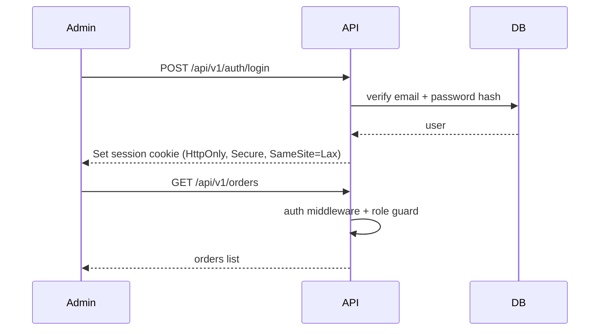

# Backend Architecture

## Service Architecture (Traditional Server)

Controller/Route Organization
```text
src/
  app.ts
  server.ts
  routes/
    auth.routes.ts
    products.routes.ts
    cart.routes.ts
    orders.routes.ts
  controllers/
    auth.controller.ts
    products.controller.ts
    cart.controller.ts
    orders.controller.ts
  middleware/
    auth.middleware.ts
    role.middleware.ts
    rateLimit.middleware.ts
    session.middleware.ts
    error.middleware.ts
  services/
    auth.service.ts
    products.service.ts
    cart.service.ts
    orders.service.ts
  repositories/
    user.repo.ts
    product.repo.ts
    order.repo.ts
  db/
    index.ts
    migrations/
  storage/
    localStorage.ts
  utils/
    logger.ts
    validate.ts
```

Controller Template
```typescript
// products.controller.ts
import { listProducts } from "../services/products.service";

export async function getProducts(req, res, next) {
  try {
    const products = await listProducts();
    res.json(products);
  } catch (err) {
    next(err);
  }
}
```

## Database Architecture
- Knex.js (MariaDB) with built-in migrations.
- Thin repository layer on top of Knex.

## Authentication and Authorization
- `express-session` + `express-mysql-session` for production session store.
- In-memory session store for local dev only.
- Zod validation on all request bodies.
- Error shape: `{ error: { code, message, details? } }` from a single error middleware.

Auth Flow


Middleware/Guards (example)
```typescript
export function requireAuth(req, res, next) {
  if (!req.session?.userId) return res.status(401).json({ error: { message: "Unauthorized" } });
  next();
}
```

Notes:
- CORS allowlist with credentials enabled; origin from `API_ALLOWED_ORIGIN`.
- Rate limiting applied to `/api/v1/orders` and `/api/v1/auth/login`.
