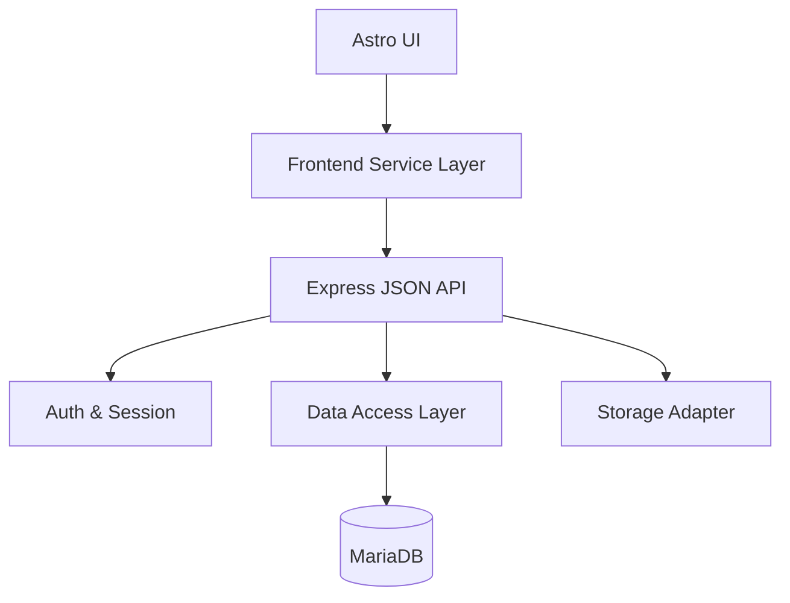

# Components

## Astro UI (Static)
**Responsibility:** Render vitrine/blog/commerce pages with minimal neutral UI and accessible structure.

**Key Interfaces:**
- `GET /api/v1/products`
- `POST /api/v1/cart/items`, `PATCH /api/v1/cart/items/{productId}`, `DELETE /api/v1/cart/items/{productId}`
- `POST /api/v1/orders`

**Dependencies:** Frontend Service Layer, API Client, Shared Types

**Technology Stack:** Astro + TypeScript

## API Client (Fetch Wrapper)
**Responsibility:** Base URL handling, credentials/cookies, error normalization, typed responses.

**Key Interfaces:**
- `request<T>(path, options)`

**Dependencies:** Shared Types

**Technology Stack:** TypeScript

## Frontend Service Layer
**Responsibility:** Encapsulate API calls and map JSON to typed models.

**Key Interfaces:**
- ProductService (list/get)
- CartService (get/add/update/remove)
- OrderService (create)

**Dependencies:** API Client, Shared Types

**Technology Stack:** TypeScript

## JSON API Service (Express)
**Responsibility:** Expose REST endpoints, handle auth/session, cart, orders, and admin product CRUD.

**Key Interfaces:**
- `/api/v1/auth/*`
- `/api/v1/products/*`
- `/api/v1/cart/*`
- `/api/v1/orders/*`

**Dependencies:** Data Access Layer, Auth/Session Middleware, Logger

**Technology Stack:** Node.js + Express + TypeScript

## Auth & Session Module
**Responsibility:** Login/logout, session management, role checks, rate limiting.

**Key Interfaces:**
- Session middleware
- Role guard

**Dependencies:** User repository, Session store

**Technology Stack:** Express middleware + session store

**Session Store:** DB-backed (MariaDB) in production; in-memory allowed for local dev.

## Data Access Layer (Repository)
**Responsibility:** CRUD for Users, Products, Orders, OrderItems.

**Key Interfaces:**
- UserRepo, ProductRepo, OrderRepo

**Dependencies:** MariaDB driver (PostgreSQL optional)

**Technology Stack:** Knex.js (migrations) + repository layer

## Storage Adapter
**Responsibility:** Read/write product images on local filesystem; optional S3 adapter later.

**Key Interfaces:**
- saveFile, getFilePath

**Dependencies:** FS

**Technology Stack:** Node.js fs

## Component Diagram

