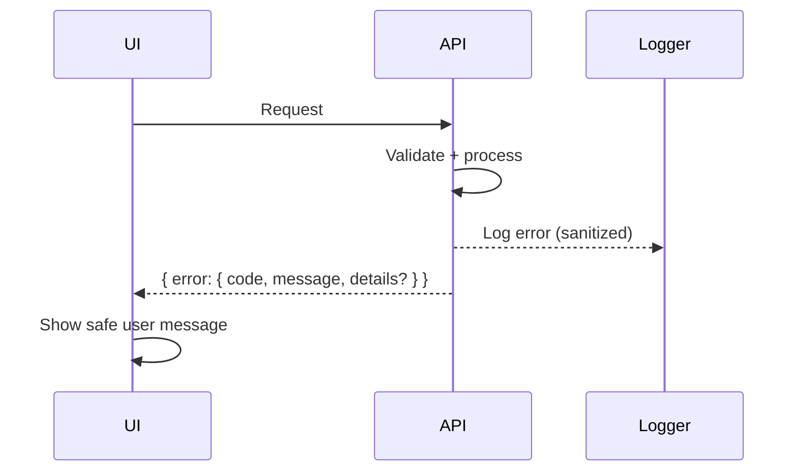

# Error Handling Strategy

Error Flow


Error Response Format
```typescript
export interface ApiError {
  error: {
    code: string;
    message: string;
    details?: Record<string, unknown>;
  };
}
```

Frontend Error Handling
```typescript
export function normalizeApiError(e: unknown): string {
  if (e && typeof e === "object" && "error" in e) {
    return (e as any).error?.message || "Request failed";
  }
  return "Request failed";
}
```

Backend Error Handling
```typescript
export function errorMiddleware(err, req, res, next) {
  const code = err.code || "INTERNAL_ERROR";
  const message = err.message || "Unexpected error";
  res.status(err.status || 500).json({ error: { code, message } });
}
```
