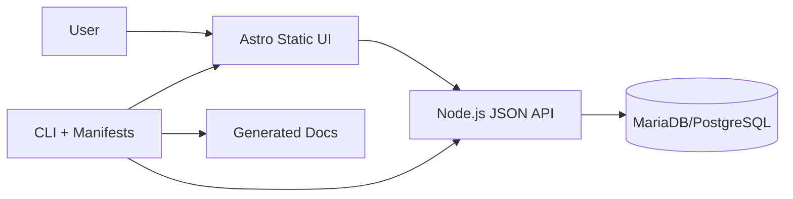

# High Level Architecture

## Technical Summary
The system is a monorepo that contains the CLI, module manifests/templates, a static Astro UI, and an optional self-hosted Node.js JSON API for backend-enabled presets. Frontend defaults to static output with minimal, accessible UI and no default branding, while backend modules run as a separate API service (no Astro SSR by default). The CLI composes projects using manifests and patch points, ensuring module isolation and clean outputs. Deployment targets are static hosting for UI and o2switch for the JSON API, aligned with the self-hosted constraints. This architecture meets the goals of fast reuse, strict module boundaries, and a complete internal baseline for commerce workflows.

## Platform and Infrastructure Choice
**Option A: o2switch (Static UI + Node.js JSON API)**
- Pros: Matches self-hosted constraint; avoids SaaS; supports MariaDB/PostgreSQL; aligns with deployment defaults.
- Cons: Requires manual ops discipline (backups, logs, monitoring).

**Option B: Self-hosted VPS (same architecture, non-o2switch)**
- Pros: Maximum control; portable architecture.
- Cons: Higher ops burden and less aligned to primary hosting.

**Option C: Local-first + manual deploy scripts**
- Pros: Simplest path; minimal tooling.
- Cons: Less repeatable and more error-prone at scale.

**Recommendation:** Option A (o2switch static UI + Node.js JSON API), with Option B as fallback for portability.

## Repository Structure
**Structure:** Monorepo (generator/tooling repo only)
**Monorepo Tool:** npm/pnpm workspaces
**Package Organization:**
- `packages/cli` (create/add/remove, manifest processing)
- `packages/modules` (module manifests + module file templates/snippets)
- `packages/shared` (types, config schema, utilities)
- `templates/base` (Astro base template source)
- `templates/presets/*` (vitrine/blog/commerce composition metadata or preset manifests)
- `docs/` (PRD, architecture, generated docs)
- `examples/` or `sandbox/` (optional smoke tests, not for generated apps)

## High Level Architecture Diagram

## Architectural Patterns
- **Static-First UI + Separate API:** Static frontend with a dedicated JSON API service - _Rationale:_ Clear UI/API boundary and avoids SSR by default.
- **Monorepo Workspace:** Single repo with workspaces - _Rationale:_ Shared types, simpler internal tooling.
- **Manifest-Driven Composition:** Modules defined by manifests and patch points - _Rationale:_ Predictable add/remove and clean outputs.
- **Service Layer on Frontend:** API access encapsulated in services - _Rationale:_ Consistent data access and testability.
- **Repository/Data Access Layer:** Abstract DB operations - _Rationale:_ Supports MariaDB default with PostgreSQL portability.
